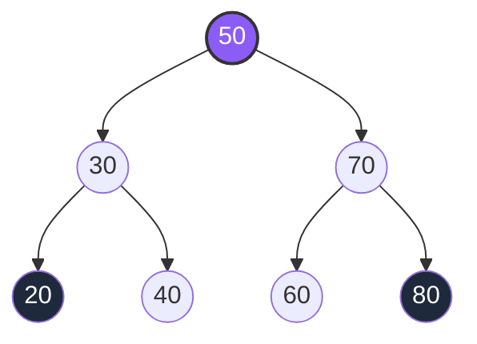
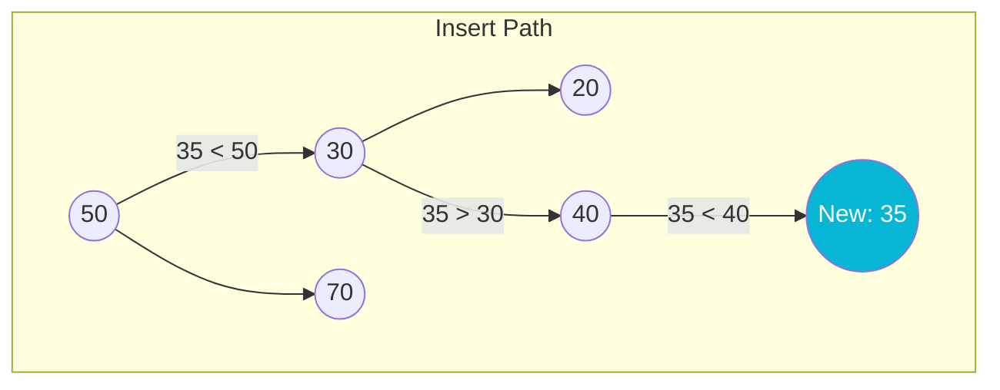
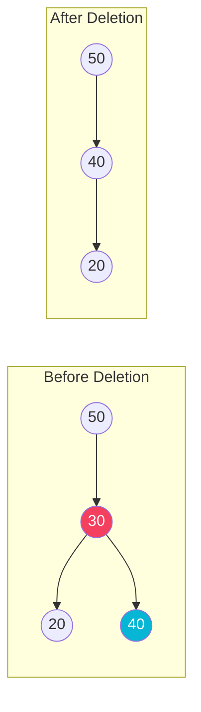

# Binary Search Tree (BST)

A **Binary Search Tree (BST)** is an ordered binary tree that maintains a strict binary search invariant:
* The left subtree of a node contains only nodes with keys **less than** the node's key.
* The right subtree of a node contains only nodes with keys **greater than** the node's key.
* The left and right subtrees must also be binary search trees.

## Structure and Visual Representation



## BST Operations & Complexity

| Operation | Best Case | Average Case | Worst Case (Skewed Tree) | Space Complexity |
| :--- | :---: | :---: | :---: | :---: |
| **Search** | $O(1)$ | $O(\log N)$ | $O(N)$ | $O(H)$ (recursion stack) |
| **Insert** | $O(1)$ | $O(\log N)$ | $O(N)$ | $O(H)$ (recursion stack) |
| **Delete** | $O(1)$ | $O(\log N)$ | $O(N)$ | $O(H)$ (recursion stack) |

---

## Step-by-Step Operations

### 1. Insertion Operation
Inserting `35` into the BST:
1. Start at `50` $\rightarrow$ $35 < 50$, go left to `30`.
2. Compare with `30` $\rightarrow$ $35 > 30$, go right to `40`.
3. Compare with `40` $\rightarrow$ $35 < 40$, go left (position is null, insert).



### 2. Deletion Operation (Node with 2 Children)
Deleting `30` from the tree. It is replaced by its **inorder successor** (the smallest value in its right subtree, which is `40`).



---

## Java Implementation Example

```java
public class BST {
    static class Node {
        int data;
        Node left, right;
        Node(int data) { this.data = data; }
    }

    private Node root;

    public void insert(int value) {
        root = insertRec(root, value);
    }

    private Node insertRec(Node root, int value) {
        if (root == null) {
            return new Node(value);
        }
        if (value < root.data) {
            root.left = insertRec(root.left, value);
        } else if (value > root.data) {
            root.right = insertRec(root.right, value);
        }
        return root;
    }
}
```
