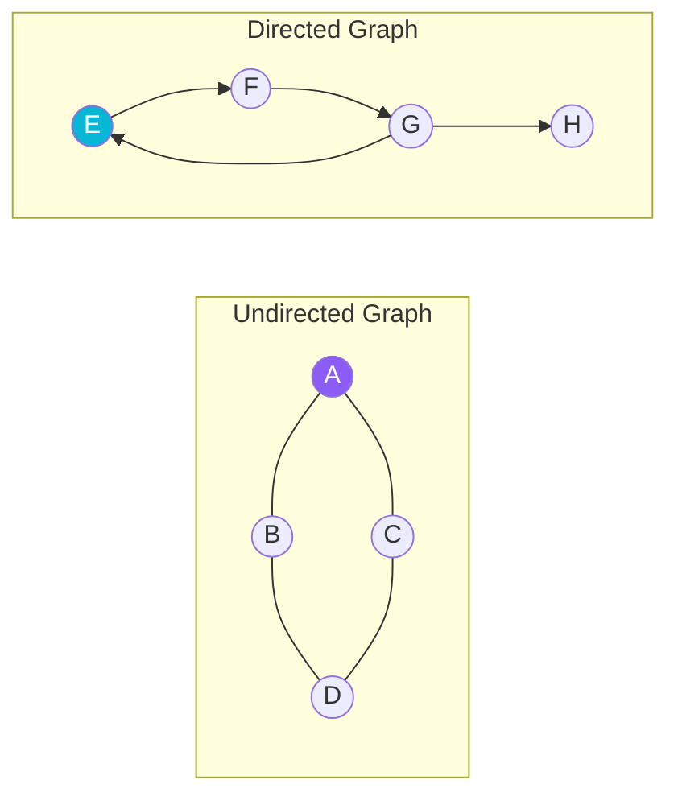
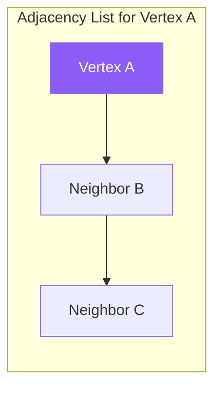
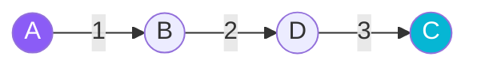

# Graph Data Structure

A **Graph** is a non-linear data structure consisting of two components:
1. **Vertices (or Nodes)**: The entities.
2. **Edges**: The links connecting pairs of vertices. Edges can be directed or undirected, and weighted or unweighted.

## Structure and Visual Representation



---

## Graph Representations

### 1. Adjacency Matrix
A 2D array where cell `[i][j] = 1` indicates an edge between vertex `i` and `j`. Excellent for dense graphs.

### 2. Adjacency List
An array of lists, where list at index `i` contains neighbors of vertex `i`. Memory efficient for sparse graphs.



---

## Graph Traversals

| Traversal | Logic / Strategy | Data Structure Used | Time / Space Complexity |
| :--- | :--- | :---: | :---: |
| **Breadth-First Search (BFS)** | Explore level-by-level (nearest neighbors first) | **Queue** | $O(V + E)$ / $O(V)$ |
| **Depth-First Search (DFS)** | Explore deep along branches before backtracking | **Stack / Recursion** | $O(V + E)$ / $O(V)$ |

---

## Step-by-Step Traversals

### 1. BFS Traversal
Exploring neighbors level-by-level starting from `A`:
1. Visit `A` $\rightarrow$ Queue neighbors: `[B, C]`.
2. Dequeue `B` $\rightarrow$ Visit `B` $\rightarrow$ Queue neighbors: `[D]`. Queue is now `[C, D]`.
3. Dequeue `C` $\rightarrow$ Visit `C` $\rightarrow$ Queue neighbors: (all visited).
4. Dequeue `D` $\rightarrow$ Visit `D`.
*Result order: `A → B → C → D`*

```mermaid
graph TD
    step1(Start A: Queue=[B,C]) --> step2(Visit B: Queue=[C,D])
    step2 --> step3(Visit C: Queue=[D])
    step3 --> step4(Visit D: Queue=[])
```

### 2. DFS Traversal (Deep Dive)
Going down a single path completely before backtracking. Starting from `A`:
`A → B → D → C` (then backtracks to `A`).



---

## Java Implementation Example (Adjacency List)

```java
import java.util.ArrayList;
import java.util.LinkedList;
import java.util.Queue;

public class Graph {
    private int numVertices;
    private ArrayList<ArrayList<Integer>> adjList;

    public Graph(int vertices) {
        this.numVertices = vertices;
        this.adjList = new ArrayList<>(vertices);
        for (int i = 0; i < vertices; i++) {
            adjList.add(new ArrayList<>());
        }
    }

    public void addEdge(int src, int dest) {
        adjList.get(src).add(dest);
        adjList.get(dest).add(src); // for undirected graph
    }

    public void bfs(int startVertex) {
        boolean[] visited = new boolean[numVertices];
        Queue<Integer> queue = new LinkedList<>();

        visited[startVertex] = true;
        queue.add(startVertex);

        while (!queue.isEmpty()) {
            int curr = queue.poll();
            System.out.print(curr + " ");

            for (int neighbor : adjList.get(curr)) {
                if (!visited[neighbor]) {
                    visited[neighbor] = true;
                    queue.add(neighbor);
                }
            }
        }
    }
}
```
