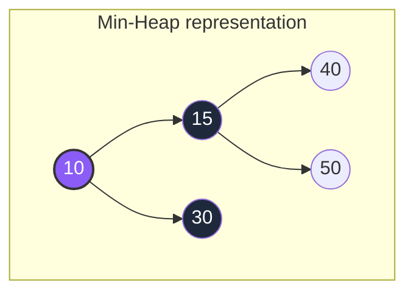
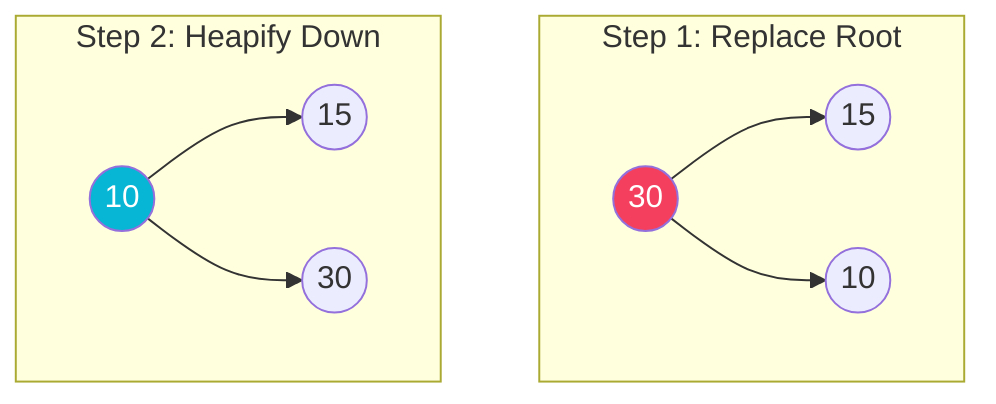

# Heap Data Structure

A **Heap** is a specialized tree-based data structure that satisfies the **Heap Property**:
* **Min-Heap**: The value of each node is greater than or equal to the value of its parent, with the minimum-value element at the root.
* **Max-Heap**: The value of each node is less than or equal to the value of its parent, with the maximum-value element at the root.

It is a **Complete Binary Tree** (all levels are filled completely except possibly the lowest, which is filled from left to right), allowing it to be efficiently stored in an **array**.

## Structure and Array Mapping



### Array Mapping Formula
For any node at index $i$:
* $\text{Parent Index} = (i - 1) / 2$
* $\text{Left Child Index} = 2i + 1$
* $\text{Right Child Index} = 2i + 2$

---

## Heap Operations & Complexity

| Operation | Description | Time Complexity | Space Complexity |
| :--- | :--- | :---: | :---: |
| **Insert** | Adds a value at the end, then sifts/heapifies up | $O(\log N)$ | $O(1)$ |
| **Extract Min/Max** | Removes and returns the root, replaces with last, sifts/heapifies down | $O(\log N)$ | $O(1)$ |
| **Peek** | Returns root element without removing it | $O(1)$ | $O(1)$ |
| **Build Heap** | Converts an unordered array to a heap | $O(N)$ | $O(1)$ |

---

## Step-by-Step Operations

### 1. Insert Operation (Heapify Up / siftUp)
Inserting `5` into the Min-Heap.
1. Insert `5` at the end (as left child of `30`).
2. $5 < 30$: Swap `5` and `30` (heapify-up).
3. $5 < 10$: Swap `5` and `10` (reaches root, stops).

```mermaid
graph TD
    subgraph Step 1: Insert at End
        i1((10)) --> i2((15))
        i1 --> i3((30))
        i3 --> i4((New: 5))
        style i4 fill:#f43f5e,color:#fff
    end
    subgraph Step 2: Swap Up (Final)
        f1((5)) --> f2((15))
        f1 --> f3((10))
        f3 --> f4((30))
        style f1 fill:#06b6d4,color:#fff
    end
```

### 2. Extract Min (Heapify Down / siftDown)
Extracting `5` from the Min-Heap.
1. Replace root `5` with the last node `30`.
2. Heapify down: Compare `30` with children `15` and `10`. Swap with smaller child `10`.
3. Stop (no more children).



---

## Java Implementation Example (Min-Heap)

```java
public class MinHeap {
    private int[] data;
    private int size;
    private int capacity;

    public MinHeap(int capacity) {
        this.capacity = capacity;
        this.data = new int[capacity];
        this.size = 0;
    }

    public void insert(int val) {
        if (size == capacity) return;
        data[size] = val;
        heapifyUp(size);
        size++;
    }

    private void heapifyUp(int i) {
        while (i > 0 && data[(i - 1) / 2] > data[i]) {
            swap(i, (i - 1) / 2);
            i = (i - 1) / 2;
        }
    }

    private void swap(int i, int j) {
        int temp = data[i];
        data[i] = data[j];
        data[j] = temp;
    }
}
```
