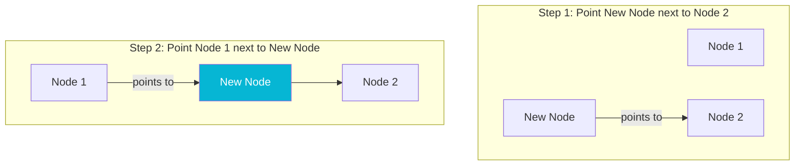
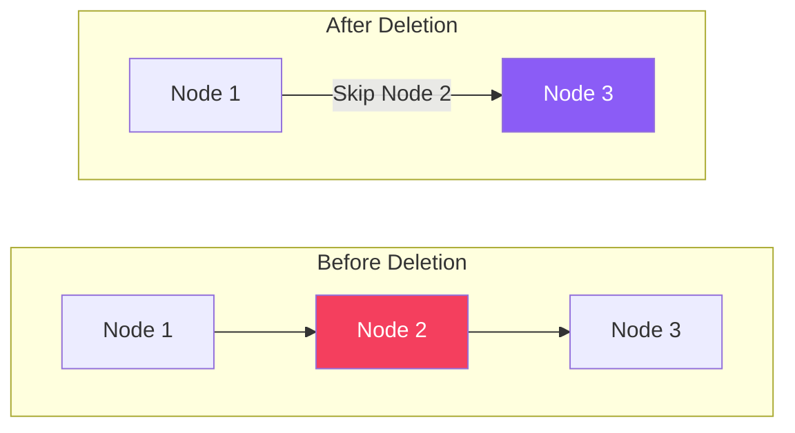

# Linked List Data Structure

A **Linked List** is a linear data structure where elements are not stored in contiguous memory locations. Instead, each element (node) contains two parts:
1. **Data**: The value stored in the node.
2. **Next Pointer**: A reference pointing to the next node in the sequence.

## Types of Linked Lists

### 1. Singly Linked List
Nodes contain data and a single pointer to the next node.

```mermaid
graph LR
    Head[Head] --> Node1(Data 1 | Next)
    Node1 --> Node2(Data 2 | Next)
    Node2 --> Node3(Data 3 | Next)
    Node3 --> Null[Null / Tail]
    style Head fill:#8b5cf6,color:#fff
    style Null fill:#1e293b,color:#fff
```

### 2. Doubly Linked List
Nodes contain pointers to both the next and the previous nodes.

```mermaid
graph LR
    Head[Head] --> Node1(Prev | Data 1 | Next)
    Node1 -->|Next| Node2(Prev | Data 2 | Next)
    Node2 -->|Prev| Node1
    Node2 -->|Next| Node3(Prev | Data 3 | Next)
    Node3 -->|Prev| Node2
    Node3 --> Null[Null]
    style Head fill:#8b5cf6,color:#fff
```

### 3. Circular Linked List
The tail node points back to the head node instead of `Null`.

```mermaid
graph LR
    Head[Head] --> Node1(Data 1 | Next)
    Node1 --> Node2(Data 2 | Next)
    Node2 --> Node3(Data 3 | Next)
    Node3 -->|Loop| Node1
    style Head fill:#8b5cf6,color:#fff
```

---

## Linked List Operations & Complexity

| Operation | Best Case | Average Case | Worst Case | Space Complexity |
| :--- | :---: | :---: | :---: | :---: |
| **Insert at Head** | $O(1)$ | $O(1)$ | $O(1)$ | $O(1)$ |
| **Insert at Tail** | $O(1)$ (with tail pointer) | $O(N)$ | $O(N)$ | $O(1)$ |
| **Delete Node** | $O(1)$ (at head) | $O(N)$ | $O(N)$ | $O(1)$ |
| **Search** | $O(1)$ | $O(N)$ | $O(N)$ | $O(1)$ |

---

## Step-by-Step Operations

### 1. Insertion at Middle (Singly Linked List)
Inserting `New Node` between `Node 1` and `Node 2`.



### 2. Deletion of Middle Node
Deleting `Node 2` by making `Node 1` skip `Node 2` and point directly to `Node 3`.



---

## Java Implementation example (Singly Linked List)

```java
public class SinglyLinkedList {
    private static class Node {
        int data;
        Node next;
        Node(int data) { this.data = data; }
    }

    private Node head;

    public void insertAtHead(int val) {
        Node newNode = new Node(val);
        newNode.next = head;
        head = newNode;
    }

    public void delete(int val) {
        if (head == null) return;
        if (head.data == val) {
            head = head.next;
            return;
        }
        Node cur = head;
        while (cur.next != null && cur.next.data != val) {
            cur = cur.next;
        }
        if (cur.next != null) {
            cur.next = cur.next.next;
        }
    }
}
```
