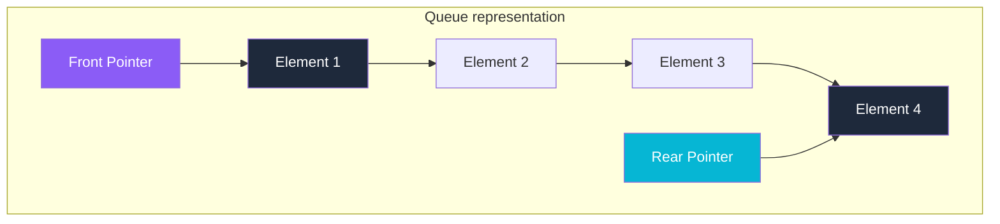
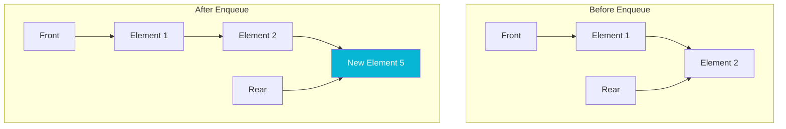
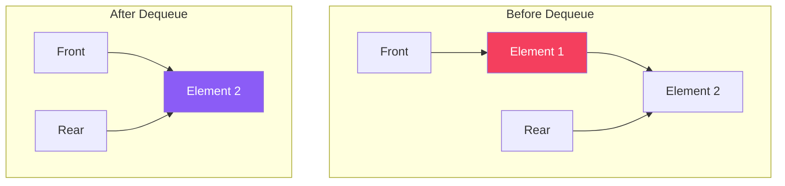

# Queue Data Structure

A **Queue** is a linear data structure that follows the **FIFO (First In, First Out)** principle. The first element added to the queue will be the first one to be removed, similar to a line of people waiting for a ticket.

## Structure and Visual Representation

A Queue has two pointers:
- **Front**: Points to the first element (where elements are removed/dequeued).
- **Rear**: Points to the last element (where elements are inserted/enqueued).



## Standard Queue Operations

| Operation | Description | Time Complexity | Space Complexity |
| :--- | :--- | :---: | :---: |
| **Enqueue** | Inserts an element at the rear of the queue | $O(1)$ | $O(1)$ |
| **Dequeue** | Removes and returns the element at the front | $O(1)$ | $O(1)$ |
| **Peek / Front**| Returns the front element without removing it | $O(1)$ | $O(1)$ |
| **isEmpty** | Checks if the queue is empty | $O(1)$ | $O(1)$ |

---

## Step-by-Step Operation Diagrams

### 1. Enqueue Operation
Adding `Element 5` to the queue. The `Rear` pointer moves to point to the new element.



### 2. Dequeue Operation
Removing the front element. The `Front` pointer moves to the next element.



---

## Java Implementation Example

### Circular Queue (Array-Based)
```java
public class CircularQueue {
    private int[] data;
    private int front, rear, size, capacity;

    public CircularQueue(int capacity) {
        this.capacity = capacity;
        this.data = new int[capacity];
        this.front = this.size = 0;
        this.rear = capacity - 1;
    }

    public void enqueue(int item) {
        if (size == capacity) {
            throw new RuntimeException("Queue is Full");
        }
        rear = (rear + 1) % capacity;
        data[rear] = item;
        size++;
    }

    public int dequeue() {
        if (size == 0) {
            throw new RuntimeException("Queue is Empty");
        }
        int item = data[front];
        front = (front + 1) % capacity;
        size--;
        return item;
    }
}
```
