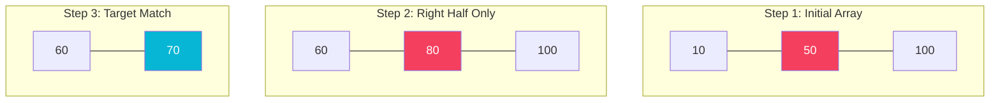
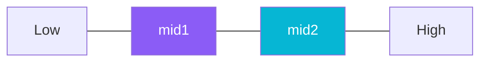
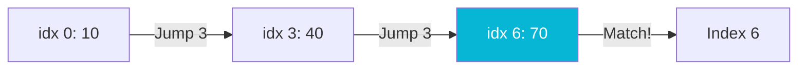

# Searching Algorithms

Searching is the algorithmic process of finding a target value within a collection of elements. The collection can be sorted or unsorted, which determines the best strategy to use.

## Searching Algorithms Comparison

| Algorithm | Best Case | Average Case | Worst Case | Space Complexity | Sorted Required? |
| :--- | :---: | :---: | :---: | :---: | :---: |
| **Linear Search** | $O(1)$ | $O(N)$ | $O(N)$ | $O(1)$ | No |
| **Binary Search** | $O(1)$ | $O(\log N)$ | $O(\log N)$ | $O(1)$ / $O(\log N)$ | Yes |
| **Ternary Search** | $O(1)$ | $O(\log_3 N)$ | $O(\log_3 N)$ | $O(1)$ / $O(\log_3 N)$ | Yes |
| **Jump Search** | $O(1)$ | $O(\sqrt{N})$ | $O(\sqrt{N})$ | $O(1)$ | Yes |
| **Interpolation Search** | $O(1)$ | $O(\log \log N)$ | $O(N)$ | $O(1)$ | Yes (Uniform) |
| **Exponential Search** | $O(1)$ | $O(\log N)$ | $O(\log N)$ | $O(1)$ | Yes |

---

## Step-by-Step Operation Diagrams

### 1. Binary Search (Divide & Conquer)
Searching for `70` in sorted array `[10, 20, 30, 40, 50, 60, 70, 80, 90, 100]`.
* Step 1: `mid = 50`. Since $70 > 50$, discard left half.
* Step 2: Search space becomes `[60, 70, 80, 90, 100]`. `mid = 80`. Since $70 < 80$, discard right half.
* Step 3: Search space becomes `[60, 70]`. `mid = 70` (match found!).



### 2. Ternary Search (Splits into 3 regions)
Uses two midpoints `mid1` and `mid2` to split search space into three sub-ranges.



### 3. Jump Search (Square Root block steps)
Searching for `70` with step size $m = \sqrt{10} \approx 3$.
* Jump index $0 \rightarrow 3 \rightarrow 6 \rightarrow 9$.
* Target $70$ is between index $6$ (`70`) and $9$ (`100`). Perform linear search in that block.



---

## Java Implementation example (Binary Search - Iterative)

```java
public class Searching {
    public static int binarySearch(int[] arr, int target) {
        int low = 0;
        int high = arr.length - 1;

        while (low <= high) {
            int mid = low + (high - low) / 2; // prevents integer overflow
            if (arr[mid] == target) {
                return mid;
            }
            if (arr[mid] < target) {
                low = mid + 1;
            } else {
                high = mid - 1;
            }
        }
        return -1; // target not found
    }
}
```
