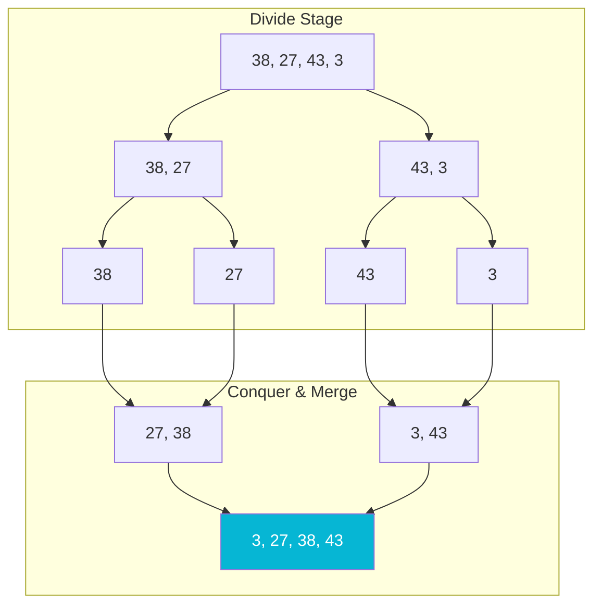
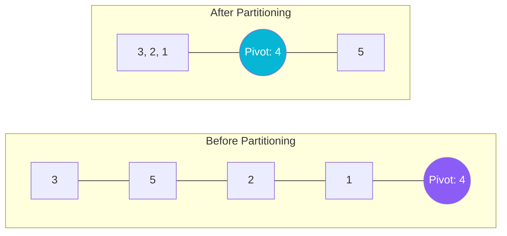

# Sorting Algorithms

Sorting is the process of arranging elements in a logical, structured sequence (typically ascending or descending order). Sorting algorithms are classified into comparison-based and non-comparison-based types.

## Sorting Complexity & Stability Matrix

| Algorithm | Best Case | Average Case | Worst Case | Space Complexity | Stability |
| :--- | :---: | :---: | :---: | :---: | :---: |
| **Bubble Sort** | $O(N)$ | $O(N^2)$ | $O(N^2)$ | $O(1)$ | **Stable** |
| **Selection Sort** | $O(N^2)$ | $O(N^2)$ | $O(N^2)$ | $O(1)$ | **Unstable** |
| **Insertion Sort** | $O(N)$ | $O(N^2)$ | $O(N^2)$ | $O(1)$ | **Stable** |
| **Merge Sort** | $O(N \log N)$ | $O(N \log N)$ | $O(N \log N)$ | $O(N)$ | **Stable** |
| **Quick Sort** | $O(N \log N)$ | $O(N \log N)$ | $O(N^2)$ | $O(\log N)$ | **Unstable** |
| **Heap Sort** | $O(N \log N)$ | $O(N \log N)$ | $O(N \log N)$ | $O(1)$ | **Unstable** |
| **Counting Sort** | $O(N + K)$ | $O(N + K)$ | $O(N + K)$ | $O(N + K)$ | **Stable** |
| **Radix Sort** | $O(d(N + B))$ | $O(d(N + B))$ | $O(d(N + B))$ | $O(N + B)$ | **Stable** |

---

## Step-by-Step Operations

### 1. Merge Sort (Divide & Conquer)
Splitting the array recursively, then merging back sorted sub-arrays.



### 2. Quick Sort Partitioning
Choose pivot (e.g. `4`), partition array so all elements smaller than `4` go to left, larger to right.



---

## Java Implementation Example (Quick Sort)

```java
public class QuickSort {
    public static void sort(int[] arr) {
        quickSort(arr, 0, arr.length - 1);
    }

    private static void quickSort(int[] arr, int low, int high) {
        if (low < high) {
            int p = partition(arr, low, high);
            quickSort(arr, low, p);
            quickSort(arr, p + 1, high);
        }
    }

    private static int partition(int[] arr, int low, int high) {
        int pivot = arr[low + (high - low) / 2];
        int i = low - 1;
        int j = high + 1;
        while (true) {
            do { i++; } while (arr[i] < pivot);
            do { j--; } while (arr[j] > pivot);
            if (i >= j) return j;
            
            // Swap
            int temp = arr[i];
            arr[i] = arr[j];
            arr[j] = temp;
        }
    }
}
```
