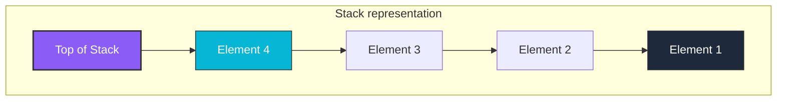
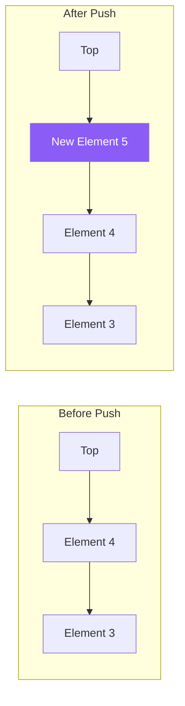
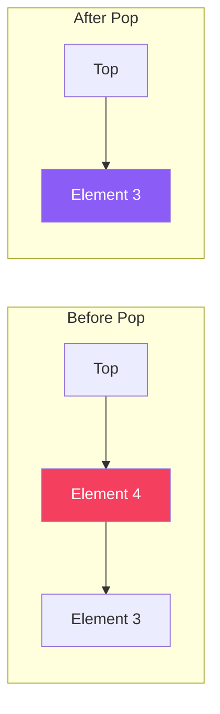

# Stack Data Structure

A **Stack** is a linear data structure that follows the **LIFO (Last In, First Out)** principle. The last element added to the stack is the first one to be removed. It behaves similarly to a stack of plates in a cafeteria.

## Structure and Visual Representation

In a Stack, all insertions and deletions are restricted to a single end called the **Top** of the stack.



## Standard Stack Operations

| Operation | Description | Time Complexity | Space Complexity |
| :--- | :--- | :---: | :---: |
| **Push** | Adds an element to the top of the stack | $O(1)$ | $O(1)$ |
| **Pop** | Removes and returns the top element of the stack | $O(1)$ | $O(1)$ |
| **Peek / Top** | Returns the top element without removing it | $O(1)$ | $O(1)$ |
| **isEmpty** | Checks if the stack is empty | $O(1)$ | $O(1)$ |
| **isFull** | Checks if the stack is full (for array-based implementations) | $O(1)$ | $O(1)$ |

---

## Step-by-Step Operation Diagrams

### 1. Push Operation
Adding `Element 5` to the stack. The top pointer moves up.



### 2. Pop Operation
Removing the top element (`Element 4`). The top pointer shifts down to the next element.



---

## Java Implementation Examples

### Array-Based Stack
```java
public class ArrayStack {
    private int[] arr;
    private int top;
    private int capacity;

    public ArrayStack(int size) {
        arr = new int[size];
        capacity = size;
        top = -1;
    }

    public void push(int val) {
        if (top == capacity - 1) {
            throw new StackOverflowError("Stack is Full");
        }
        arr[++top] = val;
    }

    public int pop() {
        if (top == -1) {
            throw new RuntimeException("Stack is Empty");
        }
        return arr[top--];
    }

    public int peek() {
        if (top == -1) {
            throw new RuntimeException("Stack is Empty");
        }
        return arr[top];
    }
}
```
