# Java Operations Documentation

@[/home/dev/Projects/java/Java-learn]

### Linkdin_List/Linkdin_list.java

#### Operation: `deleteAtLast`

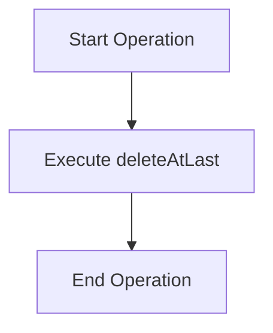

#### Operation: `deleteAtFirst`

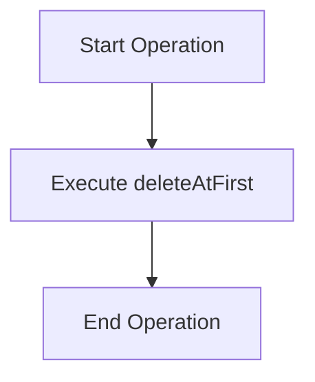

#### Operation: `search`

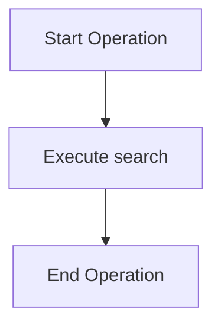

#### Operation: `get`

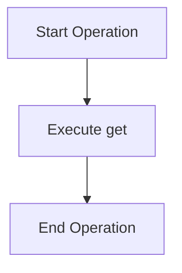

#### Operation: `length`

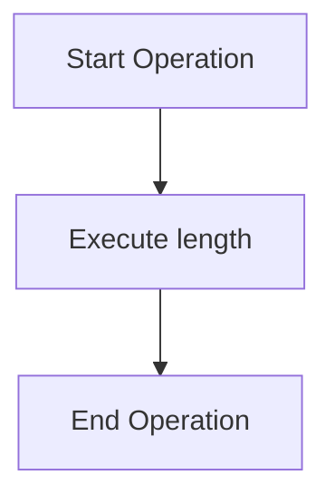

#### Operation: `insertAtPosition`

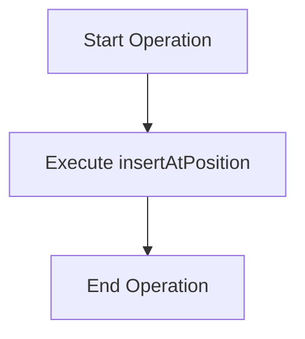

#### Operation: `deleteByValue`

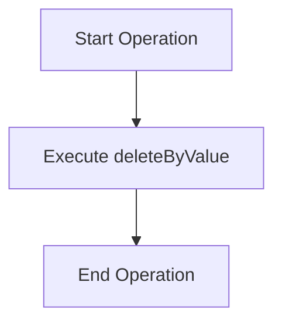

#### Operation: `display`

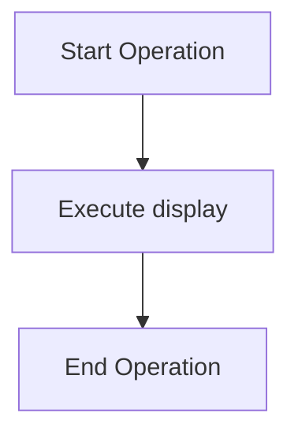

#### Operation: `reverse`

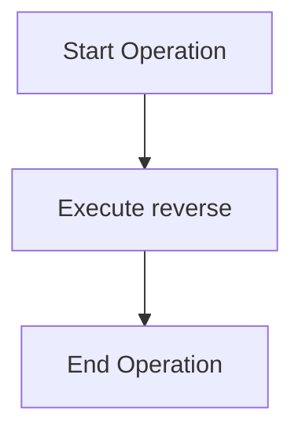

#### Operation: `insertAtMiddle`

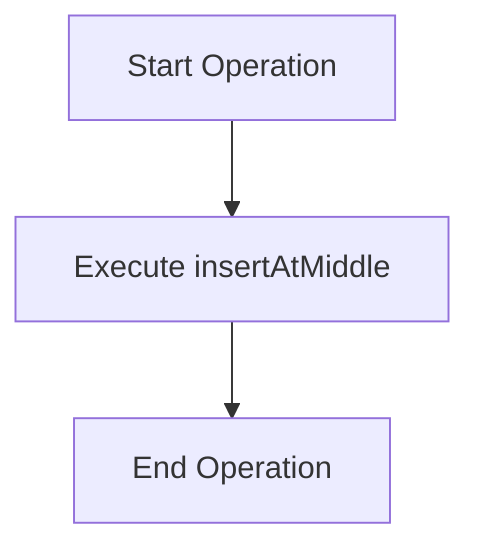

#### Operation: `insertAtFirst`

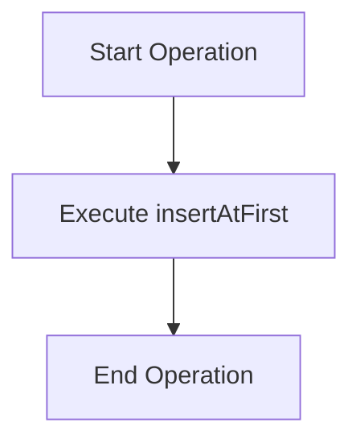

#### Operation: `deleteAtPosition`

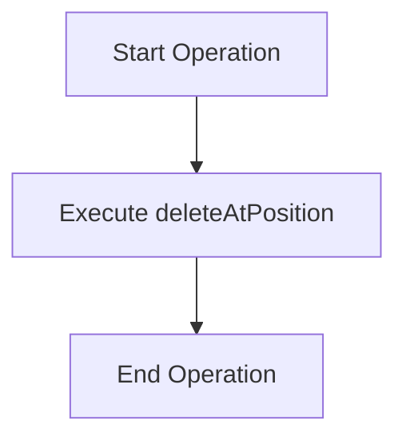

#### Operation: `isEmpty`

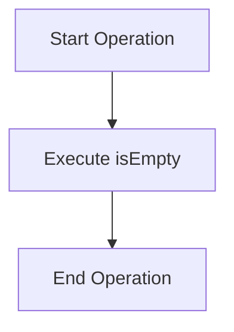

#### Operation: `getMiddle`

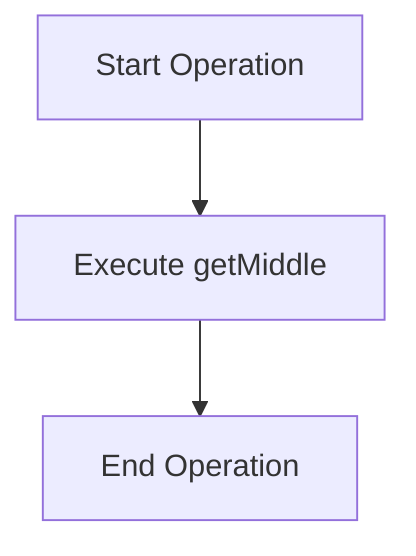

#### Operation: `insertAtLast`

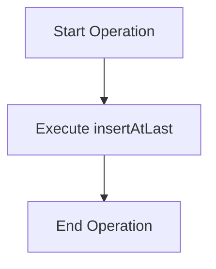

#### Operation: `deleteAtMiddle`

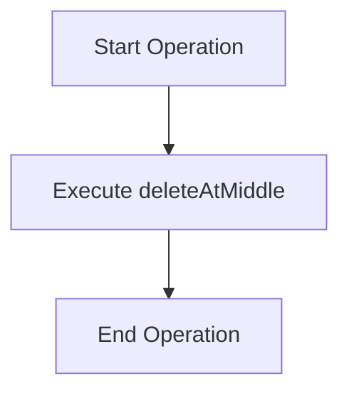

@[/home/dev/Projects/java/Java-learn]

### Linkdin_List/DoublyLinkedList.java

#### Operation: `deleteAtLast`


#### Operation: `deleteAtFirst`


#### Operation: `search`


#### Operation: `length`


#### Operation: `insertAtPosition`

```mermaid
graph TD
    A[Start Operation] --> B[Execute insertAtPosition]
    B --> C[End Operation]
```

#### Operation: `displayForward`

```mermaid
graph TD
    A[Start Operation] --> B[Execute displayForward]
    B --> C[End Operation]
```

#### Operation: `deleteByValue`

```mermaid
graph TD
    A[Start Operation] --> B[Execute deleteByValue]
    B --> C[End Operation]
```

#### Operation: `displayBackward`

```mermaid
graph TD
    A[Start Operation] --> B[Execute displayBackward]
    B --> C[End Operation]
```

#### Operation: `insertAtFirst`

```mermaid
graph TD
    A[Start Operation] --> B[Execute insertAtFirst]
    B --> C[End Operation]
```

#### Operation: `deleteAtPosition`

```mermaid
graph TD
    A[Start Operation] --> B[Execute deleteAtPosition]
    B --> C[End Operation]
```

#### Operation: `isEmpty`

```mermaid
graph TD
    A[Start Operation] --> B[Execute isEmpty]
    B --> C[End Operation]
```

#### Operation: `reverse`

```mermaid
graph TD
    A[Start Operation] --> B[Execute reverse]
    B --> C[End Operation]
```

#### Operation: `insertAtLast`

```mermaid
graph TD
    A[Start Operation] --> B[Execute insertAtLast]
    B --> C[End Operation]
```

@[/home/dev/Projects/java/Java-learn]

### Linkdin_List/CircularLinkedList.java

#### Operation: `getTail`

```mermaid
graph TD
    A[Start Operation] --> B[Execute getTail]
    B --> C[End Operation]
```

#### Operation: `deleteAtLast`

```mermaid
graph TD
    A[Start Operation] --> B[Execute deleteAtLast]
    B --> C[End Operation]
```

#### Operation: `deleteAtFirst`

```mermaid
graph TD
    A[Start Operation] --> B[Execute deleteAtFirst]
    B --> C[End Operation]
```

#### Operation: `search`

```mermaid
graph TD
    A[Start Operation] --> B[Execute search]
    B --> C[End Operation]
```

#### Operation: `length`

```mermaid
graph TD
    A[Start Operation] --> B[Execute length]
    B --> C[End Operation]
```

#### Operation: `insertAtPosition`

```mermaid
graph TD
    A[Start Operation] --> B[Execute insertAtPosition]
    B --> C[End Operation]
```

#### Operation: `deleteByValue`

```mermaid
graph TD
    A[Start Operation] --> B[Execute deleteByValue]
    B --> C[End Operation]
```

#### Operation: `display`

```mermaid
graph TD
    A[Start Operation] --> B[Execute display]
    B --> C[End Operation]
```

#### Operation: `insertAtFirst`

```mermaid
graph TD
    A[Start Operation] --> B[Execute insertAtFirst]
    B --> C[End Operation]
```

#### Operation: `deleteAtPosition`

```mermaid
graph TD
    A[Start Operation] --> B[Execute deleteAtPosition]
    B --> C[End Operation]
```

#### Operation: `isEmpty`

```mermaid
graph TD
    A[Start Operation] --> B[Execute isEmpty]
    B --> C[End Operation]
```

#### Operation: `insertAtLast`

```mermaid
graph TD
    A[Start Operation] --> B[Execute insertAtLast]
    B --> C[End Operation]
```

@[/home/dev/Projects/java/Java-learn]

### non-linear-data/ graph/Graph.java

#### Operation: `valid`

```mermaid
graph TD
    A[Start Operation] --> B[Execute valid]
    B --> C[End Operation]
```

#### Operation: `bfsCycleCheck`

```mermaid
graph TD
    A[Start Operation] --> B[Execute bfsCycleCheck]
    B --> C[End Operation]
```

#### Operation: `removeEdge`

```mermaid
graph TD
    A[Start Operation] --> B[Execute removeEdge]
    B --> C[End Operation]
```

#### Operation: `hasEdge`

```mermaid
graph TD
    A[Start Operation] --> B[Execute hasEdge]
    B --> C[End Operation]
```

#### Operation: `connectedComponents`

```mermaid
graph TD
    A[Start Operation] --> B[Execute connectedComponents]
    B --> C[End Operation]
```

#### Operation: `hasCycle`

```mermaid
graph TD
    A[Start Operation] --> B[Execute hasCycle]
    B --> C[End Operation]
```

#### Operation: `addEdge`

```mermaid
graph TD
    A[Start Operation] --> B[Execute addEdge]
    B --> C[End Operation]
```

#### Operation: `degree`

```mermaid
graph TD
    A[Start Operation] --> B[Execute degree]
    B --> C[End Operation]
```

#### Operation: `dfsIterative`

```mermaid
graph TD
    A[Start Operation] --> B[Execute dfsIterative]
    B --> C[End Operation]
```

#### Operation: `dfsHelper`

```mermaid
graph TD
    A[Start Operation] --> B[Execute dfsHelper]
    B --> C[End Operation]
```

#### Operation: `vertices`

```mermaid
graph TD
    A[Start Operation] --> B[Execute vertices]
    B --> C[End Operation]
```

#### Operation: `bfs`

```mermaid
graph TD
    A[Start Operation] --> B[Execute bfs]
    B --> C[End Operation]
```

#### Operation: `display`

```mermaid
graph TD
    A[Start Operation] --> B[Execute display]
    B --> C[End Operation]
```

#### Operation: `dfs`

```mermaid
graph TD
    A[Start Operation] --> B[Execute dfs]
    B --> C[End Operation]
```

#### Operation: `shortestPath`

```mermaid
graph TD
    A[Start Operation] --> B[Execute shortestPath]
    B --> C[End Operation]
```

#### Operation: `dfsCycleCheck`

```mermaid
graph TD
    A[Start Operation] --> B[Execute dfsCycleCheck]
    B --> C[End Operation]
```

#### Operation: `isConnected`

```mermaid
graph TD
    A[Start Operation] --> B[Execute isConnected]
    B --> C[End Operation]
```

@[/home/dev/Projects/java/Java-learn]

### non-linear-data/Trees/Heap.java

#### Operation: `peek`

```mermaid
graph TD
    A[Start Operation] --> B[Execute peek]
    B --> C[End Operation]
```

#### Operation: `insert`

```mermaid
graph TD
    A[Start Operation] --> B[Execute insert]
    B --> C[End Operation]
```

#### Operation: `swap`

```mermaid
graph TD
    A[Start Operation] --> B[Execute swap]
    B --> C[End Operation]
```

#### Operation: `buildHeap`

```mermaid
graph TD
    A[Start Operation] --> B[Execute buildHeap]
    B --> C[End Operation]
```

#### Operation: `extractMax`

```mermaid
graph TD
    A[Start Operation] --> B[Execute extractMax]
    B --> C[End Operation]
```

#### Operation: `heapSort`

```mermaid
graph TD
    A[Start Operation] --> B[Execute heapSort]
    B --> C[End Operation]
```

#### Operation: `extractMin`

```mermaid
graph TD
    A[Start Operation] --> B[Execute extractMin]
    B --> C[End Operation]
```

#### Operation: `rightChild`

```mermaid
graph TD
    A[Start Operation] --> B[Execute rightChild]
    B --> C[End Operation]
```

#### Operation: `heapifyDown`

```mermaid
graph TD
    A[Start Operation] --> B[Execute heapifyDown]
    B --> C[End Operation]
```

#### Operation: `display`

```mermaid
graph TD
    A[Start Operation] --> B[Execute display]
    B --> C[End Operation]
```

#### Operation: `parent`

```mermaid
graph TD
    A[Start Operation] --> B[Execute parent]
    B --> C[End Operation]
```

#### Operation: `leftChild`

```mermaid
graph TD
    A[Start Operation] --> B[Execute leftChild]
    B --> C[End Operation]
```

#### Operation: `heapifyUp`

```mermaid
graph TD
    A[Start Operation] --> B[Execute heapifyUp]
    B --> C[End Operation]
```

#### Operation: `delete`

```mermaid
graph TD
    A[Start Operation] --> B[Execute delete]
    B --> C[End Operation]
```

#### Operation: `isEmpty`

```mermaid
graph TD
    A[Start Operation] --> B[Execute isEmpty]
    B --> C[End Operation]
```

#### Operation: `size`

```mermaid
graph TD
    A[Start Operation] --> B[Execute size]
    B --> C[End Operation]
```

#### Operation: `isFull`

```mermaid
graph TD
    A[Start Operation] --> B[Execute isFull]
    B --> C[End Operation]
```

@[/home/dev/Projects/java/Java-learn]

### non-linear-data/Trees/AVLTree.java

#### Operation: `bf`

```mermaid
graph TD
    A[Start Operation] --> B[Execute bf]
    B --> C[End Operation]
```

#### Operation: `getBalanceFactor`

```mermaid
graph TD
    A[Start Operation] --> B[Execute getBalanceFactor]
    B --> C[End Operation]
```

#### Operation: `rebalance`

```mermaid
graph TD
    A[Start Operation] --> B[Execute rebalance]
    B --> C[End Operation]
```

#### Operation: `preorder`

```mermaid
graph TD
    A[Start Operation] --> B[Execute preorder]
    B --> C[End Operation]
```

#### Operation: `rotateLeft`

```mermaid
graph TD
    A[Start Operation] --> B[Execute rotateLeft]
    B --> C[End Operation]
```

#### Operation: `insert`

```mermaid
graph TD
    A[Start Operation] --> B[Execute insert]
    B --> C[End Operation]
```

#### Operation: `rotateRight`

```mermaid
graph TD
    A[Start Operation] --> B[Execute rotateRight]
    B --> C[End Operation]
```

#### Operation: `height`

```mermaid
graph TD
    A[Start Operation] --> B[Execute height]
    B --> C[End Operation]
```

#### Operation: `minNode`

```mermaid
graph TD
    A[Start Operation] --> B[Execute minNode]
    B --> C[End Operation]
```

#### Operation: `inorder`

```mermaid
graph TD
    A[Start Operation] --> B[Execute inorder]
    B --> C[End Operation]
```

#### Operation: `updateHeight`

```mermaid
graph TD
    A[Start Operation] --> B[Execute updateHeight]
    B --> C[End Operation]
```

#### Operation: `delete`

```mermaid
graph TD
    A[Start Operation] --> B[Execute delete]
    B --> C[End Operation]
```

#### Operation: `display`

```mermaid
graph TD
    A[Start Operation] --> B[Execute display]
    B --> C[End Operation]
```

#### Operation: `search`

```mermaid
graph TD
    A[Start Operation] --> B[Execute search]
    B --> C[End Operation]
```

@[/home/dev/Projects/java/Java-learn]

### non-linear-data/Trees/BST.java

#### Operation: `min`

```mermaid
graph TD
    A[Start Operation] --> B[Execute min]
    B --> C[End Operation]
```

#### Operation: `max`

```mermaid
graph TD
    A[Start Operation] --> B[Execute max]
    B --> C[End Operation]
```

#### Operation: `preorder`

```mermaid
graph TD
    A[Start Operation] --> B[Execute preorder]
    B --> C[End Operation]
```

#### Operation: `postorder`

```mermaid
graph TD
    A[Start Operation] --> B[Execute postorder]
    B --> C[End Operation]
```

#### Operation: `insert`

```mermaid
graph TD
    A[Start Operation] --> B[Execute insert]
    B --> C[End Operation]
```

#### Operation: `countLeaves`

```mermaid
graph TD
    A[Start Operation] --> B[Execute countLeaves]
    B --> C[End Operation]
```

#### Operation: `count`

```mermaid
graph TD
    A[Start Operation] --> B[Execute count]
    B --> C[End Operation]
```

#### Operation: `countNodes`

```mermaid
graph TD
    A[Start Operation] --> B[Execute countNodes]
    B --> C[End Operation]
```

#### Operation: `height`

```mermaid
graph TD
    A[Start Operation] --> B[Execute height]
    B --> C[End Operation]
```

#### Operation: `leaves`

```mermaid
graph TD
    A[Start Operation] --> B[Execute leaves]
    B --> C[End Operation]
```

#### Operation: `inorder`

```mermaid
graph TD
    A[Start Operation] --> B[Execute inorder]
    B --> C[End Operation]
```

#### Operation: `display`

```mermaid
graph TD
    A[Start Operation] --> B[Execute display]
    B --> C[End Operation]
```

#### Operation: `inorderSuccessor`

```mermaid
graph TD
    A[Start Operation] --> B[Execute inorderSuccessor]
    B --> C[End Operation]
```

#### Operation: `delete`

```mermaid
graph TD
    A[Start Operation] --> B[Execute delete]
    B --> C[End Operation]
```

#### Operation: `isEmpty`

```mermaid
graph TD
    A[Start Operation] --> B[Execute isEmpty]
    B --> C[End Operation]
```

#### Operation: `search`

```mermaid
graph TD
    A[Start Operation] --> B[Execute search]
    B --> C[End Operation]
```

@[/home/dev/Projects/java/Java-learn]

### non-linear-data/Trees/BinaryTree.java

#### Operation: `preorder`

```mermaid
graph TD
    A[Start Operation] --> B[Execute preorder]
    B --> C[End Operation]
```

#### Operation: `postorder`

```mermaid
graph TD
    A[Start Operation] --> B[Execute postorder]
    B --> C[End Operation]
```

#### Operation: `insert`

```mermaid
graph TD
    A[Start Operation] --> B[Execute insert]
    B --> C[End Operation]
```

#### Operation: `countLeaves`

```mermaid
graph TD
    A[Start Operation] --> B[Execute countLeaves]
    B --> C[End Operation]
```

#### Operation: `levelOrder`

```mermaid
graph TD
    A[Start Operation] --> B[Execute levelOrder]
    B --> C[End Operation]
```

#### Operation: `countNodes`

```mermaid
graph TD
    A[Start Operation] --> B[Execute countNodes]
    B --> C[End Operation]
```

#### Operation: `height`

```mermaid
graph TD
    A[Start Operation] --> B[Execute height]
    B --> C[End Operation]
```

#### Operation: `inorder`

```mermaid
graph TD
    A[Start Operation] --> B[Execute inorder]
    B --> C[End Operation]
```

#### Operation: `isEmpty`

```mermaid
graph TD
    A[Start Operation] --> B[Execute isEmpty]
    B --> C[End Operation]
```

#### Operation: `display`

```mermaid
graph TD
    A[Start Operation] --> B[Execute display]
    B --> C[End Operation]
```

#### Operation: `search`

```mermaid
graph TD
    A[Start Operation] --> B[Execute search]
    B --> C[End Operation]
```

@[/home/dev/Projects/java/Java-learn]

### Queue_DSA/LinkedQueue.java

#### Operation: `clear`

```mermaid
graph TD
    A[Start Operation] --> B[Execute clear]
    B --> C[End Operation]
```

#### Operation: `peek`

```mermaid
graph TD
    A[Start Operation] --> B[Execute peek]
    B --> C[End Operation]
```

#### Operation: `enqueue`

```mermaid
graph TD
    A[Start Operation] --> B[Execute enqueue]
    B --> C[End Operation]
```

#### Operation: `dequeue`

```mermaid
graph TD
    A[Start Operation] --> B[Execute dequeue]
    B --> C[End Operation]
```

#### Operation: `peekRear`

```mermaid
graph TD
    A[Start Operation] --> B[Execute peekRear]
    B --> C[End Operation]
```

#### Operation: `display`

```mermaid
graph TD
    A[Start Operation] --> B[Execute display]
    B --> C[End Operation]
```

#### Operation: `size`

```mermaid
graph TD
    A[Start Operation] --> B[Execute size]
    B --> C[End Operation]
```

#### Operation: `isEmpty`

```mermaid
graph TD
    A[Start Operation] --> B[Execute isEmpty]
    B --> C[End Operation]
```

#### Operation: `search`

```mermaid
graph TD
    A[Start Operation] --> B[Execute search]
    B --> C[End Operation]
```

@[/home/dev/Projects/java/Java-learn]

### Queue_DSA/CircularQueue.java

#### Operation: `clear`

```mermaid
graph TD
    A[Start Operation] --> B[Execute clear]
    B --> C[End Operation]
```

#### Operation: `peek`

```mermaid
graph TD
    A[Start Operation] --> B[Execute peek]
    B --> C[End Operation]
```

#### Operation: `enqueue`

```mermaid
graph TD
    A[Start Operation] --> B[Execute enqueue]
    B --> C[End Operation]
```

#### Operation: `dequeue`

```mermaid
graph TD
    A[Start Operation] --> B[Execute dequeue]
    B --> C[End Operation]
```

#### Operation: `peekRear`

```mermaid
graph TD
    A[Start Operation] --> B[Execute peekRear]
    B --> C[End Operation]
```

#### Operation: `display`

```mermaid
graph TD
    A[Start Operation] --> B[Execute display]
    B --> C[End Operation]
```

#### Operation: `size`

```mermaid
graph TD
    A[Start Operation] --> B[Execute size]
    B --> C[End Operation]
```

#### Operation: `isEmpty`

```mermaid
graph TD
    A[Start Operation] --> B[Execute isEmpty]
    B --> C[End Operation]
```

#### Operation: `isFull`

```mermaid
graph TD
    A[Start Operation] --> B[Execute isFull]
    B --> C[End Operation]
```

@[/home/dev/Projects/java/Java-learn]

### Queue_DSA/PriorityQueue.java

#### Operation: `peek`

```mermaid
graph TD
    A[Start Operation] --> B[Execute peek]
    B --> C[End Operation]
```

#### Operation: `left`

```mermaid
graph TD
    A[Start Operation] --> B[Execute left]
    B --> C[End Operation]
```

#### Operation: `enqueue`

```mermaid
graph TD
    A[Start Operation] --> B[Execute enqueue]
    B --> C[End Operation]
```

#### Operation: `swap`

```mermaid
graph TD
    A[Start Operation] --> B[Execute swap]
    B --> C[End Operation]
```

#### Operation: `dequeue`

```mermaid
graph TD
    A[Start Operation] --> B[Execute dequeue]
    B --> C[End Operation]
```

#### Operation: `heapifyDown`

```mermaid
graph TD
    A[Start Operation] --> B[Execute heapifyDown]
    B --> C[End Operation]
```

#### Operation: `display`

```mermaid
graph TD
    A[Start Operation] --> B[Execute display]
    B --> C[End Operation]
```

#### Operation: `right`

```mermaid
graph TD
    A[Start Operation] --> B[Execute right]
    B --> C[End Operation]
```

#### Operation: `toString`

```mermaid
graph TD
    A[Start Operation] --> B[Execute toString]
    B --> C[End Operation]
```

#### Operation: `parent`

```mermaid
graph TD
    A[Start Operation] --> B[Execute parent]
    B --> C[End Operation]
```

#### Operation: `heapifyUp`

```mermaid
graph TD
    A[Start Operation] --> B[Execute heapifyUp]
    B --> C[End Operation]
```

#### Operation: `isEmpty`

```mermaid
graph TD
    A[Start Operation] --> B[Execute isEmpty]
    B --> C[End Operation]
```

#### Operation: `size`

```mermaid
graph TD
    A[Start Operation] --> B[Execute size]
    B --> C[End Operation]
```

#### Operation: `isFull`

```mermaid
graph TD
    A[Start Operation] --> B[Execute isFull]
    B --> C[End Operation]
```

@[/home/dev/Projects/java/Java-learn]

### Queue_DSA/LinearQueue.java

#### Operation: `clear`

```mermaid
graph TD
    A[Start Operation] --> B[Execute clear]
    B --> C[End Operation]
```

#### Operation: `peek`

```mermaid
graph TD
    A[Start Operation] --> B[Execute peek]
    B --> C[End Operation]
```

#### Operation: `enqueue`

```mermaid
graph TD
    A[Start Operation] --> B[Execute enqueue]
    B --> C[End Operation]
```

#### Operation: `dequeue`

```mermaid
graph TD
    A[Start Operation] --> B[Execute dequeue]
    B --> C[End Operation]
```

#### Operation: `peekRear`

```mermaid
graph TD
    A[Start Operation] --> B[Execute peekRear]
    B --> C[End Operation]
```

#### Operation: `display`

```mermaid
graph TD
    A[Start Operation] --> B[Execute display]
    B --> C[End Operation]
```

#### Operation: `size`

```mermaid
graph TD
    A[Start Operation] --> B[Execute size]
    B --> C[End Operation]
```

#### Operation: `isEmpty`

```mermaid
graph TD
    A[Start Operation] --> B[Execute isEmpty]
    B --> C[End Operation]
```

#### Operation: `search`

```mermaid
graph TD
    A[Start Operation] --> B[Execute search]
    B --> C[End Operation]
```

#### Operation: `isFull`

```mermaid
graph TD
    A[Start Operation] --> B[Execute isFull]
    B --> C[End Operation]
```

@[/home/dev/Projects/java/Java-learn]

### Queue_DSA/Queue.java

#### Operation: `clear`

```mermaid
graph TD
    A[Start Operation] --> B[Execute clear]
    B --> C[End Operation]
```

#### Operation: `peek`

```mermaid
graph TD
    A[Start Operation] --> B[Execute peek]
    B --> C[End Operation]
```

#### Operation: `enqueue`

```mermaid
graph TD
    A[Start Operation] --> B[Execute enqueue]
    B --> C[End Operation]
```

#### Operation: `dequeue`

```mermaid
graph TD
    A[Start Operation] --> B[Execute dequeue]
    B --> C[End Operation]
```

#### Operation: `display`

```mermaid
graph TD
    A[Start Operation] --> B[Execute display]
    B --> C[End Operation]
```

#### Operation: `size`

```mermaid
graph TD
    A[Start Operation] --> B[Execute size]
    B --> C[End Operation]
```

#### Operation: `isEmpty`

```mermaid
graph TD
    A[Start Operation] --> B[Execute isEmpty]
    B --> C[End Operation]
```

#### Operation: `search`

```mermaid
graph TD
    A[Start Operation] --> B[Execute search]
    B --> C[End Operation]
```

#### Operation: `isFull`

```mermaid
graph TD
    A[Start Operation] --> B[Execute isFull]
    B --> C[End Operation]
```

@[/home/dev/Projects/java/Java-learn]

### Queue_DSA/Deque.java

#### Operation: `insertRear`

```mermaid
graph TD
    A[Start Operation] --> B[Execute insertRear]
    B --> C[End Operation]
```

#### Operation: `clear`

```mermaid
graph TD
    A[Start Operation] --> B[Execute clear]
    B --> C[End Operation]
```

#### Operation: `insertFront`

```mermaid
graph TD
    A[Start Operation] --> B[Execute insertFront]
    B --> C[End Operation]
```

#### Operation: `deleteRear`

```mermaid
graph TD
    A[Start Operation] --> B[Execute deleteRear]
    B --> C[End Operation]
```

#### Operation: `peekRear`

```mermaid
graph TD
    A[Start Operation] --> B[Execute peekRear]
    B --> C[End Operation]
```

#### Operation: `peekFront`

```mermaid
graph TD
    A[Start Operation] --> B[Execute peekFront]
    B --> C[End Operation]
```

#### Operation: `display`

```mermaid
graph TD
    A[Start Operation] --> B[Execute display]
    B --> C[End Operation]
```

#### Operation: `size`

```mermaid
graph TD
    A[Start Operation] --> B[Execute size]
    B --> C[End Operation]
```

#### Operation: `deleteFront`

```mermaid
graph TD
    A[Start Operation] --> B[Execute deleteFront]
    B --> C[End Operation]
```

#### Operation: `isEmpty`

```mermaid
graph TD
    A[Start Operation] --> B[Execute isEmpty]
    B --> C[End Operation]
```

#### Operation: `isFull`

```mermaid
graph TD
    A[Start Operation] --> B[Execute isFull]
    B --> C[End Operation]
```

@[/home/dev/Projects/java/Java-learn]

### Recursiveprogramming/Concepts.java

#### Operation: `tilings`

```mermaid
graph TD
    A[Start Operation] --> B[Execute tilings]
    B --> C[End Operation]
```

#### Operation: `sumTail`

```mermaid
graph TD
    A[Start Operation] --> B[Execute sumTail]
    B --> C[End Operation]
```

#### Operation: `genParentheses`

```mermaid
graph TD
    A[Start Operation] --> B[Execute genParentheses]
    B --> C[End Operation]
```

#### Operation: `countDigit`

```mermaid
graph TD
    A[Start Operation] --> B[Execute countDigit]
    B --> C[End Operation]
```

#### Operation: `maxInArray`

```mermaid
graph TD
    A[Start Operation] --> B[Execute maxInArray]
    B --> C[End Operation]
```

#### Operation: `lcs`

```mermaid
graph TD
    A[Start Operation] --> B[Execute lcs]
    B --> C[End Operation]
```

#### Operation: `printBinary`

```mermaid
graph TD
    A[Start Operation] --> B[Execute printBinary]
    B --> C[End Operation]
```

#### Operation: `factorialTail`

```mermaid
graph TD
    A[Start Operation] --> B[Execute factorialTail]
    B --> C[End Operation]
```

#### Operation: `josephus`

```mermaid
graph TD
    A[Start Operation] --> B[Execute josephus]
    B --> C[End Operation]
```

#### Operation: `coinChange`

```mermaid
graph TD
    A[Start Operation] --> B[Execute coinChange]
    B --> C[End Operation]
```

#### Operation: `sumN`

```mermaid
graph TD
    A[Start Operation] --> B[Execute sumN]
    B --> C[End Operation]
```

#### Operation: `nQueens`

```mermaid
graph TD
    A[Start Operation] --> B[Execute nQueens]
    B --> C[End Operation]
```

#### Operation: `climbStairs`

```mermaid
graph TD
    A[Start Operation] --> B[Execute climbStairs]
    B --> C[End Operation]
```

#### Operation: `subsets`

```mermaid
graph TD
    A[Start Operation] --> B[Execute subsets]
    B --> C[End Operation]
```

#### Operation: `isPalindrome`

```mermaid
graph TD
    A[Start Operation] --> B[Execute isPalindrome]
    B --> C[End Operation]
```

#### Operation: `power`

```mermaid
graph TD
    A[Start Operation] --> B[Execute power]
    B --> C[End Operation]
```

#### Operation: `firstOccurrence`

```mermaid
graph TD
    A[Start Operation] --> B[Execute firstOccurrence]
    B --> C[End Operation]
```

#### Operation: `countDown`

```mermaid
graph TD
    A[Start Operation] --> B[Execute countDown]
    B --> C[End Operation]
```

#### Operation: `printBoard`

```mermaid
graph TD
    A[Start Operation] --> B[Execute printBoard]
    B --> C[End Operation]
```

#### Operation: `permutations`

```mermaid
graph TD
    A[Start Operation] --> B[Execute permutations]
    B --> C[End Operation]
```

#### Operation: `fibNaive`

```mermaid
graph TD
    A[Start Operation] --> B[Execute fibNaive]
    B --> C[End Operation]
```

#### Operation: `mergeSort`

```mermaid
graph TD
    A[Start Operation] --> B[Execute mergeSort]
    B --> C[End Operation]
```

#### Operation: `hanoi`

```mermaid
graph TD
    A[Start Operation] --> B[Execute hanoi]
    B --> C[End Operation]
```

#### Operation: `isOdd`

```mermaid
graph TD
    A[Start Operation] --> B[Execute isOdd]
    B --> C[End Operation]
```

#### Operation: `isEven`

```mermaid
graph TD
    A[Start Operation] --> B[Execute isEven]
    B --> C[End Operation]
```

#### Operation: `fibMemo`

```mermaid
graph TD
    A[Start Operation] --> B[Execute fibMemo]
    B --> C[End Operation]
```

#### Operation: `flatten`

```mermaid
graph TD
    A[Start Operation] --> B[Execute flatten]
    B --> C[End Operation]
```

#### Operation: `gridPaths`

```mermaid
graph TD
    A[Start Operation] --> B[Execute gridPaths]
    B --> C[End Operation]
```

#### Operation: `isSafe`

```mermaid
graph TD
    A[Start Operation] --> B[Execute isSafe]
    B --> C[End Operation]
```

#### Operation: `reverseString`

```mermaid
graph TD
    A[Start Operation] --> B[Execute reverseString]
    B --> C[End Operation]
```

#### Operation: `binarySearch`

```mermaid
graph TD
    A[Start Operation] --> B[Execute binarySearch]
    B --> C[End Operation]
```

#### Operation: `isSorted`

```mermaid
graph TD
    A[Start Operation] --> B[Execute isSorted]
    B --> C[End Operation]
```

#### Operation: `nCr`

```mermaid
graph TD
    A[Start Operation] --> B[Execute nCr]
    B --> C[End Operation]
```

#### Operation: `fastPow`

```mermaid
graph TD
    A[Start Operation] --> B[Execute fastPow]
    B --> C[End Operation]
```

#### Operation: `merge`

```mermaid
graph TD
    A[Start Operation] --> B[Execute merge]
    B --> C[End Operation]
```

#### Operation: `gcd`

```mermaid
graph TD
    A[Start Operation] --> B[Execute gcd]
    B --> C[End Operation]
```

#### Operation: `printAscending`

```mermaid
graph TD
    A[Start Operation] --> B[Execute printAscending]
    B --> C[End Operation]
```

#### Operation: `factorial`

```mermaid
graph TD
    A[Start Operation] --> B[Execute factorial]
    B --> C[End Operation]
```

#### Operation: `ackermann`

```mermaid
graph TD
    A[Start Operation] --> B[Execute ackermann]
    B --> C[End Operation]
```

#### Operation: `printDescending`

```mermaid
graph TD
    A[Start Operation] --> B[Execute printDescending]
    B --> C[End Operation]
```

#### Operation: `digitSum`

```mermaid
graph TD
    A[Start Operation] --> B[Execute digitSum]
    B --> C[End Operation]
```

@[/home/dev/Projects/java/Java-learn]

### Searching_Algo/Algorithms.java

#### Operation: `ternarySearch`

```mermaid
graph TD
    A[Start Operation] --> B[Execute ternarySearch]
    B --> C[End Operation]
```

#### Operation: `binarySearchRecursiveHelper`

```mermaid
graph TD
    A[Start Operation] --> B[Execute binarySearchRecursiveHelper]
    B --> C[End Operation]
```

#### Operation: `interpolationSearch`

```mermaid
graph TD
    A[Start Operation] --> B[Execute interpolationSearch]
    B --> C[End Operation]
```

#### Operation: `jumpSearch`

```mermaid
graph TD
    A[Start Operation] --> B[Execute jumpSearch]
    B --> C[End Operation]
```

#### Operation: `binarySearchIterative`

```mermaid
graph TD
    A[Start Operation] --> B[Execute binarySearchIterative]
    B --> C[End Operation]
```

#### Operation: `binarySearchRecursive`

```mermaid
graph TD
    A[Start Operation] --> B[Execute binarySearchRecursive]
    B --> C[End Operation]
```

#### Operation: `ternarySearchHelper`

```mermaid
graph TD
    A[Start Operation] --> B[Execute ternarySearchHelper]
    B --> C[End Operation]
```

#### Operation: `linearSearch`

```mermaid
graph TD
    A[Start Operation] --> B[Execute linearSearch]
    B --> C[End Operation]
```

#### Operation: `binarySearchRangeHelper`

```mermaid
graph TD
    A[Start Operation] --> B[Execute binarySearchRangeHelper]
    B --> C[End Operation]
```

#### Operation: `exponentialSearch`

```mermaid
graph TD
    A[Start Operation] --> B[Execute exponentialSearch]
    B --> C[End Operation]
```

@[/home/dev/Projects/java/Java-learn]

### Sorting/Algorithms.java

#### Operation: `quickSortHelper`

```mermaid
graph TD
    A[Start Operation] --> B[Execute quickSortHelper]
    B --> C[End Operation]
```

#### Operation: `countingSort`

```mermaid
graph TD
    A[Start Operation] --> B[Execute countingSort]
    B --> C[End Operation]
```

#### Operation: `heapSort`

```mermaid
graph TD
    A[Start Operation] --> B[Execute heapSort]
    B --> C[End Operation]
```

#### Operation: `insertionSort`

```mermaid
graph TD
    A[Start Operation] --> B[Execute insertionSort]
    B --> C[End Operation]
```

#### Operation: `mergeSort`

```mermaid
graph TD
    A[Start Operation] --> B[Execute mergeSort]
    B --> C[End Operation]
```

#### Operation: `selectionSort`

```mermaid
graph TD
    A[Start Operation] --> B[Execute selectionSort]
    B --> C[End Operation]
```

#### Operation: `partition`

```mermaid
graph TD
    A[Start Operation] --> B[Execute partition]
    B --> C[End Operation]
```

#### Operation: `merge`

```mermaid
graph TD
    A[Start Operation] --> B[Execute merge]
    B --> C[End Operation]
```

#### Operation: `quickSort`

```mermaid
graph TD
    A[Start Operation] --> B[Execute quickSort]
    B --> C[End Operation]
```

#### Operation: `heapify`

```mermaid
graph TD
    A[Start Operation] --> B[Execute heapify]
    B --> C[End Operation]
```

#### Operation: `mergeSortHelper`

```mermaid
graph TD
    A[Start Operation] --> B[Execute mergeSortHelper]
    B --> C[End Operation]
```

#### Operation: `radixSort`

```mermaid
graph TD
    A[Start Operation] --> B[Execute radixSort]
    B --> C[End Operation]
```

#### Operation: `countSortForRadix`

```mermaid
graph TD
    A[Start Operation] --> B[Execute countSortForRadix]
    B --> C[End Operation]
```

#### Operation: `bubbleSort`

```mermaid
graph TD
    A[Start Operation] --> B[Execute bubbleSort]
    B --> C[End Operation]
```

@[/home/dev/Projects/java/Java-learn]

### Sorting/main.java

#### Operation: `isSorted`

```mermaid
graph TD
    A[Start Operation] --> B[Execute isSorted]
    B --> C[End Operation]
```

@[/home/dev/Projects/java/Java-learn]

### stack/stack.java

#### Operation: `pop`

```mermaid
graph TD
    A[Start Operation] --> B[Execute pop]
    B --> C[End Operation]
```

#### Operation: `isEmpty1`

```mermaid
graph TD
    A[Start Operation] --> B[Execute isEmpty1]
    B --> C[End Operation]
```

#### Operation: `getMin`

```mermaid
graph TD
    A[Start Operation] --> B[Execute getMin]
    B --> C[End Operation]
```

#### Operation: `peek2`

```mermaid
graph TD
    A[Start Operation] --> B[Execute peek2]
    B --> C[End Operation]
```

#### Operation: `size2`

```mermaid
graph TD
    A[Start Operation] --> B[Execute size2]
    B --> C[End Operation]
```

#### Operation: `push`

```mermaid
graph TD
    A[Start Operation] --> B[Execute push]
    B --> C[End Operation]
```

#### Operation: `size1`

```mermaid
graph TD
    A[Start Operation] --> B[Execute size1]
    B --> C[End Operation]
```

#### Operation: `clear`

```mermaid
graph TD
    A[Start Operation] --> B[Execute clear]
    B --> C[End Operation]
```

#### Operation: `push1`

```mermaid
graph TD
    A[Start Operation] --> B[Execute push1]
    B --> C[End Operation]
```

#### Operation: `pop2`

```mermaid
graph TD
    A[Start Operation] --> B[Execute pop2]
    B --> C[End Operation]
```

#### Operation: `isEmpty`

```mermaid
graph TD
    A[Start Operation] --> B[Execute isEmpty]
    B --> C[End Operation]
```

#### Operation: `peek1`

```mermaid
graph TD
    A[Start Operation] --> B[Execute peek1]
    B --> C[End Operation]
```

#### Operation: `push2`

```mermaid
graph TD
    A[Start Operation] --> B[Execute push2]
    B --> C[End Operation]
```

#### Operation: `isEmpty2`

```mermaid
graph TD
    A[Start Operation] --> B[Execute isEmpty2]
    B --> C[End Operation]
```

#### Operation: `size`

```mermaid
graph TD
    A[Start Operation] --> B[Execute size]
    B --> C[End Operation]
```

#### Operation: `pop1`

```mermaid
graph TD
    A[Start Operation] --> B[Execute pop1]
    B --> C[End Operation]
```

#### Operation: `isFull`

```mermaid
graph TD
    A[Start Operation] --> B[Execute isFull]
    B --> C[End Operation]
```

#### Operation: `peek`

```mermaid
graph TD
    A[Start Operation] --> B[Execute peek]
    B --> C[End Operation]
```

#### Operation: `display`

```mermaid
graph TD
    A[Start Operation] --> B[Execute display]
    B --> C[End Operation]
```

#### Operation: `search`

```mermaid
graph TD
    A[Start Operation] --> B[Execute search]
    B --> C[End Operation]
```

